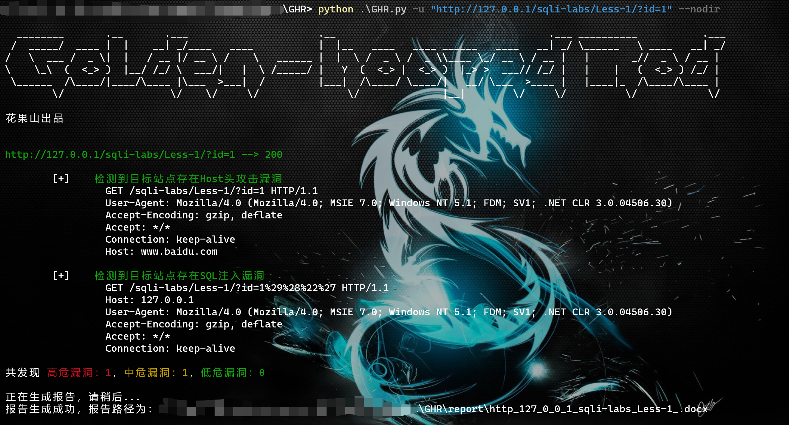
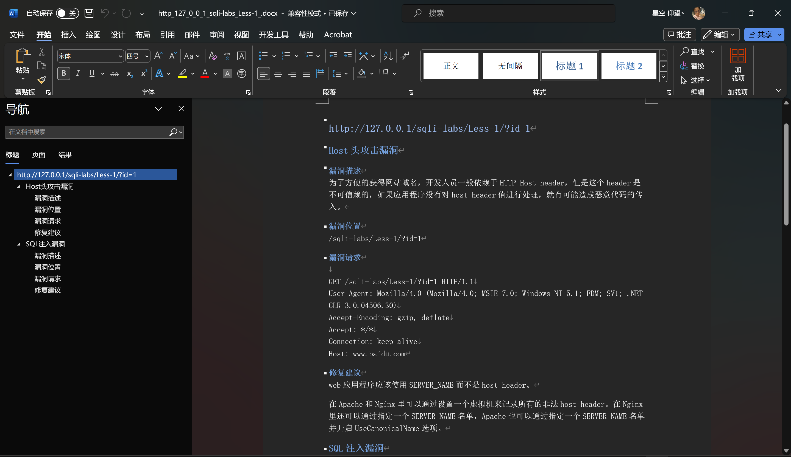

# Golden-hooped Rod

Golden-hooped Rod是一款对于web站点进行漏洞扫描的工具。工具使用python语言编写，使用的目录扫描字典均由真实环境而来。使用起来异常便捷。可以对web站点进行漏洞扫描、设置代理、设置线程等。

## 使用方法

```
usage: GHR.py [-h] [-u URL] [--ip IP] [--nodir] [--proxy PROXY] [-t THREAD]

options:
  -h, --help            show this help message and exit

GHR 常用参数:
  -u URL, --url URL     url，例：--url http://127.0.0.1/
  --nodir               禁用目录扫描
  --proxy PROXY         代理设置，例：--proxy 127.0.0.1:10809（目前仅支持HTTP，暂不支持SOCKET）
  -t THREAD, --thread THREAD
                        线程设置，例：--thread 10 默认线程数为：20

```


## 运行截图



## 报告截图



## 微信群截图


